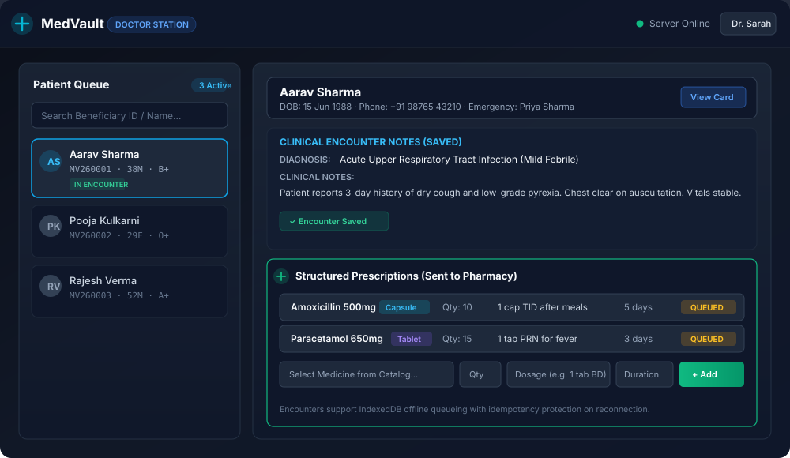
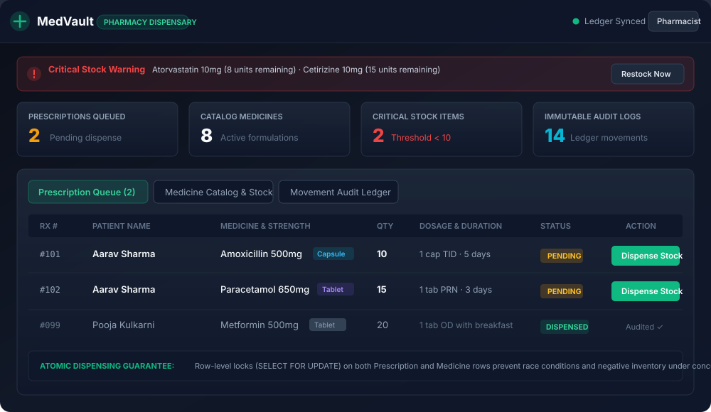
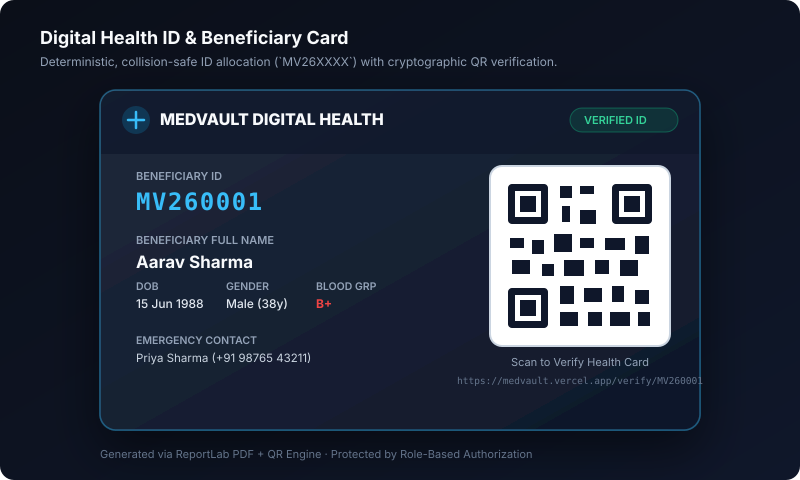

# MedVault

**MedVault** is an enterprise-grade, role-protected healthcare platform for beneficiary identity management, clinical OPD encounters, structured e-prescriptions, pharmacy inventory with row-level locks, and digital health records.

Built with **FastAPI**, **PostgreSQL** (SQLAlchemy 2.x async + Alembic), and **React 19** (TypeScript + Vite), MedVault guarantees zero race conditions in identity allocation and medicine dispensing through strict database concurrency controls.

---

## 🚀 Live Application Link

- **Production URL**: [https://med-vault-aia7.vercel.app](https://med-vault-aia7.vercel.app)
- **Deployment Status**: Active on **Vercel** (Frontend) + **Render** (FastAPI) + **Neon** (Serverless PostgreSQL)

### Demo Accounts & Station Credentials

| Station | Role | Demo Email | Demo Password | Primary Features |
|---|---|---|---|---|
| **Doctor Station** | `doctor` | `doctor@medvault.test` | `DoctorSecurePassword123!` | Central OPD consultation, diagnosis duration/remarks, drug templates, longitudinal history modal, 1-click repeat Rx |
| **Pharmacy Station** | `pharmacy` | `pharmacy@medvault.test` | `PharmacySecurePassword123!` | Atomic dispensing, critical stock alerts, inventory restock |
| **Registration Station** | `registration_worker` | `worker@medvault.test` | `WorkerSecurePassword123!` | Beneficiary registration, QR health card issuance, PDF card |
| **Patient Health Vault** | `patient` | `patient@medvault.test` | `PatientSecurePassword123!` | View personal clinical records, prescriptions, digital QR card |
| **Admin Console** | `admin` | `admin@local.test` | `AdminSecurePassword123!` | Staff provisioning, telemetry, system audit controls |

> **Quick Login Tip:** On the login screen, click any of the **Quick Demo Preset buttons** (`Doctor`, `Pharmacy`, `Registration`, `Patient`, `Admin`) to populate credentials and sign in immediately.

---

## 📸 Interface Showcase

### 1. Doctor Portal — Central OPD Consultation & Structured e-Prescriptions
Modelled on high-density government hospital & e-Hospital OPD systems (such as CGHS and NIC e-Hospital):
- **Central OPD Header**: Government health emblem badge, live 30-minute session countdown timer (`Time left: 29:45`) with interactive `🔄` token refresh, and attending medical officer badge.
- **Beneficiary Demographic Strip**: High-density patient demographic bar with Beneficiary ID, age, gender, blood group, contact, and AI clinical brief.
- **Clinical Diagnosis & Notes**: Inline diagnosis input, duration (`yrs / mos / days`), clinical observations, quick-diagnosis tags, and examination notes.
- **Drug Formulation Grid**: Structured `.gov-table` with drug selector, dosage, frequency (`1-0-1`, `1-1-1`, `BD`, `TDS`, etc.), days, auto-calculated quantity, and instructions.
- **Prescribed Medicine History Modal**: Complete historical record of all past medicines with live inventory availability and a 1-click **`[Repeat]`** button that copies past regimens directly into the active prescription table.
- **Fail-Safe Session Architecture**: Powered by a layout-level React `ErrorBoundary` and defensive timeline deserialization preventing blank screens.



---

### 2. Pharmacy Dispensary — Low-Stock Alerts & Concurrency-Safe Dispensing
Pharmacists monitor live queue items (displaying patient and medicine names), receive automated critical stock warnings (`< 10 units`), restock inventory formulations, and dispense medications with atomic stock deduction and immutable ledger logging.



---

### 3. Beneficiary Card — Collision-Safe ID & Cryptographic QR Verification
Patients receive a deterministic Beneficiary ID (`MV26XXXX`) allocated via PostgreSQL advisory locks. The digital card includes patient demographics, blood group, emergency contact, and a cryptographic QR code verifiable by emergency responders.



---

## 🛡️ Core Engineering Highlights

- **Advisory Lock Identity Allocation**: Beneficiary IDs (`MV260001+`) use PostgreSQL session advisory locks (`pg_advisory_xact_lock(260001)`) to eliminate collisions under concurrent registration spikes.
- **Atomic Two-Phase Dispensing**: Dispensing acquires row-level locks (`SELECT FOR UPDATE`) on both `Prescription` and `Medicine` rows within a single database transaction, preventing double-dispense race conditions and negative inventory.
- **Alembic Schema Evolution**: Database versioning managed via declarative Alembic migrations (including medicine formulation, dosage strength, and idempotency tables).
- **Idempotent Offline Retries**: Encounter creation supports client-provided `Idempotency-Key` headers stored in an audit table, ensuring network retries replay original responses without creating duplicate patient encounters.
- **Hybrid Online/Offline Architecture**: Frontend caches clinical encounter drafts in browser IndexedDB with automatic background synchronization when internet connectivity restores.
- **Object-Level PHI Security**: Beneficiaries are strictly constrained to their own records via custom FastAPI security dependencies; staff access is governed by granular Role-Based Access Control (RBAC).

---

## 🏛️ System Architecture

```text
                                +-----------------------------+
                                |    React 19 + TypeScript    |
                                |       Vite Modern SPA       |
                                +--------------+--------------+
                                               |
                                        Bearer JWT (HS256)
                                               |
                                +--------------v--------------+
                                |      FastAPI Application    |
                                |  Pydantic Validation + RBAC |
                                +--------------+--------------+
                                               |
                     +-------------------------+-------------------------+
                     |                                                   |
        +------------v------------+                         +------------v------------+
        |   Async Session Engine  |                         |  SlowAPI Rate Limiter   |
        | SQLAlchemy 2.0 (asyncpg)|                         | Redis / Memory Fallback |
        +------------+------------+                         +-------------------------+
                     |
        +------------v------------+
        |  PostgreSQL Database    |
        | Row Locks + Constraints |
        +-------------------------+
```

### Roles and Permission Boundaries

| Role | Permissions & Operational Scope |
| --- | --- |
| `admin` | Full operational oversight, staff account provisioning, telemetry monitoring |
| `registration_worker` | Beneficiary registration, demographic updates, digital card issuance |
| `doctor` | Patient history timeline, encounter documentation, AI clinical assistance, e-prescriptions |
| `pharmacy` | Medicine catalog management, restock operations, atomic prescription dispensing |
| `patient` | Read-only access to own clinical history, prescriptions, and digital QR card |

---

## 💻 Tech Stack Matrix

| Layer | Technologies |
|---|---|
| **Frontend** | React 19, TypeScript, Vite, React Router 6, Lucide React, IndexedDB (idb) |
| **Backend API** | FastAPI, Python 3.11+, Uvicorn, Pydantic v2 |
| **Database & ORM** | PostgreSQL, SQLAlchemy 2.0 (AsyncIO), Alembic migrations, psycopg2 / asyncpg |
| **Security & Auth** | Passlib (bcrypt), PyJWT (HS256), slowapi (Rate Limiting) |
| **Media & Reports** | ReportLab (PDF card generation), qrcode, Pillow |
| **Infrastructure** | Render (Web Service), Vercel (SPA Hosting), Neon / Supabase (Cloud PostgreSQL) |
| **Testing** | Python `unittest`, FastAPI `TestClient`, Vite production bundling |

---

## 🛠️ Local Development Setup

### 1. Backend

```powershell
cd backend
python -m venv venv
.\venv\Scripts\Activate.ps1
pip install -r requirements.txt
Copy-Item .env.example .env
```

Configure `backend/.env` with your database URL and secret key, then run:

```powershell
# Run migrations to head (revision: 0005_add_strength_form)
python -m alembic upgrade head

# Seed demo users, medicine catalog, and sample patient
python -m app.manage seed-demo

# Start the API server
python -m uvicorn app.main:app --host 127.0.0.1 --port 8000 --reload
```

- API Base: `http://127.0.0.1:8000/`
- Interactive Swagger Docs: `http://127.0.0.1:8000/docs`

### 2. Frontend

```powershell
cd frontend
npm install
npm run dev -- --host 127.0.0.1 --port 5173
```

Access `http://127.0.0.1:5173/` in your browser. Use the quick demo preset buttons on the login page for instant access.

### 3. Run Verification Tests

```powershell
# Run backend test suite (14 automated tests)
cd backend
.\venv\Scripts\python.exe -m unittest discover -s tests -v

# Run frontend typecheck and production build
cd ..\frontend
npm run build
```

---

## 🗺️ Production Roadmap

To scale MedVault from a high-assurance demo into a nationwide enterprise clinical system, the following architectural milestones are planned:

### Phase 1: Healthcare Compliance & Data Protection (HIPAA / GDPR / ABHA)
- **Field-Level Envelope Encryption**: Protect sensitive PHI (Aadhaar number, clinical encounter notes, psychiatric history) using AES-256-GCM with keys managed by AWS KMS or HashiCorp Vault.
- **Cryptographic Audit Ledger**: Implement tamper-evident, append-only audit trail logging every PHI view, query, and export with SHA-256 hash chaining.
- **Automated Compliance Controls**: Add strict session inactivity timeouts (15 minutes), forced password rotation policies, and patient consent directives.

### Phase 2: Interoperability Standards (HL7 FHIR R4)
- **FHIR REST API**: Expose standard HL7 FHIR R4 endpoints for external clinical interoperability:
  - `GET /fhir/R4/Patient/{id}`
  - `GET /fhir/R4/MedicationRequest?patient={id}`
  - `POST /fhir/R4/Encounter`
- **SMART on FHIR**: Implement OAuth2 SMART on FHIR launch profiles allowing third-party EHRs (Epic, Cerner) to embed MedVault patient records seamlessly.
- **ABDM Integration**: Connect with India's Ayushman Bharat Digital Mission (ABDM) for ABHA ID creation, Milestone 1-3 compliance, and consent manager hooks.

### Phase 3: Edge & Offline Community Health Resilience
- **CRDT Sync Engine**: Upgrade IndexedDB drafts to Conflict-Free Replicated Data Types (CRDTs) to allow rural health workers to conduct mobile medical camps offline for days without sync conflicts.
- **Edge SQLite / WebAssembly**: Run lightweight relational SQLite instances in the browser via WebAssembly for full offline search of cached village registries.
- **Multi-Facility Tenancy**: Implement schema-level or row-level tenant isolation allowing multi-hospital networks with Attribute-Based Access Control (ABAC).

### Phase 4: Enterprise Observability & High Availability
- **Distributed Tracing**: Instrument FastAPI services and database queries with OpenTelemetry (OTel), exporting traces to Jaeger/Grafana Tempo.
- **Prometheus Metrics Exporter**: Track dispensary queue saturation, dispensing transaction latencies, advisory lock acquisition times, and database connection pool metrics.
- **Read-Replica Routing**: Direct reporting queries, AI background context generation, and patient timeline lookups to PostgreSQL read replicas to preserve primary write IOPS.
- **Zero-Downtime DR**: Configure continuous WAL archiving with Point-In-Time Recovery (PITR) and multi-region failover.

---

## 📄 License

This project is licensed under the MIT License — see the [LICENSE](LICENSE) file for details.
